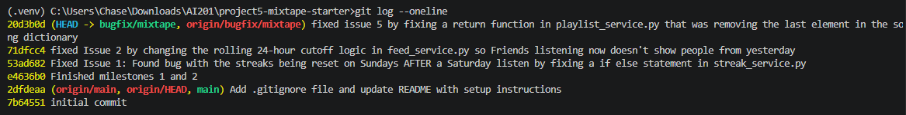

# AI usage

First, for trying to reproduce the bugs, I asked GitHub Copilot how to run these endpoints. I was struggling to get the <user_id> and asked it to help me find it. It gave me this command to run on my seeded data: -c "import sqlite3; conn=sqlite3.connect('instance/mixtape.db'); print(conn.execute('select id, username from user').fetchall())" - which had worked in showing me the 5 users and their user id's.

Second, I used Copilot to make a testing function for when the day of the week is Sunday and a user continued their streak the previous Day for issue 1. I told Copilot the issue, and asked it how I would both actually change the state of the program per day, as well as how I would use POSTMAN for proper testing of this issue. It gave me the commands and endpoints necessary, but also generated me a working test case for issue 1 in specific.

Third, I used copilot to trace feed_service.py to find what was wrong with the 24-hour logic. I gave the AI-tool the specific file, the specific issue I was having, and why I had some confusions understanding what the logic even did in the first place. Not only did it explain to me what was going on in the program with some of these functions I had never seen before, but it also pointed out the fatal flaw within the logic that was causing the error. I obviously tested and validated this by making the change it wanted me to, and then retesting in POSTMAN.

Fourth, I used copilot to help me generate commands and requests for Postman in general. What this helped me understand was both the problem I was working with at an API level and how to properly test with Postman. I had to verify with the actual outputs of the Postman requests, reading them thoroughly and not fully trusting the AI. Actually in issue 1, I was confused at first because I had tested the API endpoints, but totally missed when it said it could "make a test" for the sunday data as it was asking if I wanted that or something else. That was a mistake on my end and shows the value of fully validating the entire message that these AI tools send.

# Codebase Map

## Main Files

**app.py**
The application entry point and setup layer. It creates the Flask app, configures the database connection and secret key, initializes SQLAlchemy, registers the route blueprints for songs, playlists, users, and feed, and creates the tables when the app starts. If the user runs the file directly, it starts the development server.

**models.py**
Defines the database schema. It contains the SQLAlchemy models for users, songs, tags, listening events, ratings, playlists, and notifications, plus the association tables that handle friendships, song tags, and playlist entries. It also includes each model’s to_dict() method, which turns database rows into JSON-friendly data for the API.

**seed_data.py**
Is the data bootstrap script. It drops and recreates the database, then inserts realistic sample data: users, friendships, tags, songs, listening events, playlists, and a notification. The seeded listening events are especially useful because they drive the feed and streak behavior when the user tests the app.

## Data Flow

When a user shares a song, the app stores that relationship on the Song record through the shared_by field in models.py. The shared song is then visible to other users through the normal song and playlist routes. The notification is not created at share time; it is created later when another user interacts with that shared song by adding it to a playlist. In routes/playlists.py, the playlist route calls services.notification_service.add_to_playlist(), which first loads the Song, User, and Playlist records, appends the song to the playlist, commits the change, and then checks whether the person adding the song is different from song.shared_by. If so, create_notification() inserts a new Notification row for the original sharer with the message that their song was added to a playlist.

## Patterns

One pattern is the route/service split. The route files stay thin: they read request data, validate required fields, call a service function, and convert the result into JSON. The service files do the actual database work, like creating playlists, recording listening events, or creating notifications. A second pattern is consistent serialization with to_dict(). The models define to_dict() methods, and the services and routes reuse them when returning users, songs, playlists, listening events, and notifications. That keeps the API responses consistent and avoids duplicating formatting logic. Another repeated pattern is centralized error handling through ValueError. Service functions raise ValueError when a record is missing or input is invalid, and the route handlers catch those errors and return a JSON error message with the right HTTP status code. Finally, the last pattern is the use of db.session.add() followed by db.session.commit() whenever the app changes data. That pattern appears in playlist creation, listening event recording, notification creation, and the seed script, which makes writes easy to follow and keeps the database changes explicit.

# Fixes - Root Cause Analysis Format

## Analysis 1

**1. Issue number and title**
Issue #1 — My listening streak keeps resetting

**2. How you reproduced it**
How I reproduced it: I reproduced it by first sending in the "/users/<user_id>/streak" using Kenji's generated user_id, at the end of the url. But then I realized I had to set my program to Sunday. To do this, I wrote a test that mocks datetime.now(timezone.utc) to a sunday with Kenji listening to a song the previous day, and repopulated my data with it. Afterwards, I used POSTMAN to first send a POST request that would set the day to Sunday with: POST http://127.0.0.1:5000/songs/<user_id>/listen; with a header of Content-Type: application/json and the raw body JSON of Kenji's user_id. After this, I then reran the GET request as the state of the program was on a Sunday.

**3.How you found the root cause**
Right away, I narrowed down the files needed to look at the be streak_service.py, this would make the most sense to check first because this is an issue with the streak. If the bug was not in the file, I would then start to look more into the users routes to see if it could be a data collection issue with each user. My navigation path was first check the streak_service, then check record_listening_event(), then check update_listening_streak(). I am confident I found it in the right place due to how the streak updates, a suspicious line being in a function that would make a lot of sense for a bug like this sets my confident high.

**4. The root cause**.
What was wrong was that there is an else statement in update_listening_streak() for when the streak count goes up one. This line is: elif days_since_last == 1 and today.weekday() != 6. There is one key flaw to this condition, and that is that on Python's weeday scale, Sunday is set to value 6 as an int. Because of this, if the user had listened the day before, passing the first condition, and the current day is sunday, the loop would go to the default result, which is the streak being set back to 1.

**5. Your fix and side-effect check**
My fix was the remove the second condition on this else check all together. If the feature of streak is to go up once a day regardless of the day, then "days_since_last == 1" as a condition will suffice for the result of increasing the streak count as one. "today.weekday() != 6" is a harmful condition and is completely unnecessary for this code to run. After this was done, I reran the test that would set the program to a state of being sunday WITH kenji listening to a song on saturday, before retesting in postman with both my POST and GET requests, getting the intended result, a streak that was the number it was meant to be and not 1.

## Analysis 2

**1. Issue number and title**
Issue #2 — Friends Listening Now shows people from yesterday

**2. How you reproduced it**
How I reproduced it: I reproduced it by first updating the seeded data so that Nova is the viewer, darius is the firend whose old listen should still show up, and Darius's listening events had one update to it yesterday at 11pm. Using a command like this: python -c "import sqlite3; from datetime import datetime, timedelta; db=sqlite3.connect(r'.../project5-mixtape-starter/instance/mixtape.db'); cur=db.cursor(); cur.execute(\"update listening_event set listened_at = ? where user_id = ?\", ((datetime.now()-timedelta(days=1)).replace(hour=23, minute=0, second=0, microsecond=0).isoformat(sep=' '), '<user_id>')); db.commit(); print('updated')". I then ran a GET request to the url: http://127.0.0.1:5000/feed/<user_id>/listening-now in POSTMAN, and got a JSON return with Darius in it.

**3.How you found the root cause**
The files that I looked at where feed.py, users.py, and feed_service.py. My logic is this clearly had something to do with users and feed, so something suspicious should be in there. I actually checked the routes files first before thinking nothing was really suspicious in there and it would make a lot more sense and a service file bug anyways. Next I checked out feed_service, and right away there didn't seem to any super suspicious line. I asked my AI assistant to explain some of the math and logic of the file around the time, and figured out that there is some very incorrect logic related t othe cutoff. Thus, I believe I found it in the right place due to it being a feed service logical error in get_friends_listening_now() (which makes sense for the main issue).

**4. The root cause**.
The root cause is that there are three lines that create a specific problem in the logic. First, RECENT_THRESHOLD = timedelta(hours=24); this makes sense because there is no more than 24 hours in a day, so the threshold should push to the next day. But then with this line: cutoff = datetime.now(timezone.utc) - RECENT_THRESHOLD; came into the issue of there current date in time per timezone SUBTRACKS the 24 hour Recent Threshold. This was an eyebrow raiser as the math just didn't make sense. But then it all came together with this query filter line: ListeningEvent.listened_at >= cutoff. This program is supposed to use a 24-hour window, but the line that sets the cutoff value prepares it like it's meant to find reset from midnight by subtracting midnight time from threshold. Because of this, late day songs could transfer over to the next day, and the timezones can mess with the music a user's friends sees them listening to.

**5. Your fix and side-effect check**
My fix for this was to replace "- RECENT_THRESHOLD" with ".replace(hour=0, minute=0, second=0, microsecond=0)". This fixes the change because instead of subtracting threshold to try to get the current time to midnight, a replace function that actually fits the rolling 24-hour window the rest of the program's logic is going for. After I was done, I saved, retried the Python function that set a User to listen to a song at 11pm the previous night. Then I reran the GET in postman and got a JSON return WITHOUT Darius in it.

## Analysis 3

**1. Issue number and title**
Issue #5 — The last song in a playlist never shows up

**2. How you reproduced it**
How I reproduced it: I reproduced this bug by first running a GET request with postman on ttp://127.0.0.1:5000/playlists/<darius_user_id>/songs and it showed 6 songs when it was meant to show 7. To run a quick fix, I tried making a post request with link to darius's songs and raw JSOn body with the song_id and added_by (darius). When I tried that, I got an error about the content type, so when I tried to run the GET again, there still was only 6 songs.

**3.How you found the root cause**
Knowing from my previous two bugs where issues in the Services folder, I got the sense that there is where I should be bug hunting from here on out. Since this is an issue with the playlist, I knew I had to dive straight into playlist_service.py. I first read the first function, create_playlist(), didn't see anything out of the ordinary, read get_playlist_songs(), and something immediately caught me off guard. I knew that this had to be the right place for the bug off of knowing that this is a logical service issue that had to do with the playlists, making me confident that playlist_service.py had to be the troublemaking file.

**4. The root cause**.
The root cause was due to the return for get_playlist_songs(): "return [song.to_dict() for song in songs[:-1]]". The issue I noticed right off was the slice at the end of the function. Why would there be a slice there to begin with, and that would clearly remove the last element from the dictionary. I checked to make sure there maybe couldnt have been a bad tail and there wasn't, a slice in the return function was returning a playlist dictionary without it's last song!

**5. Your fix and side-effect check**
The fix was that I removed the "[:-1]" slice from the return function. A very fix, but a huge one, as now the data structure coudld return completed. The result was the playlist came back with the last song showing up. I tested my changes by sending a GET request into postman with the same link and data, and got 7 songs this time for Darius's user ID.

# Screenshot of Commit History

